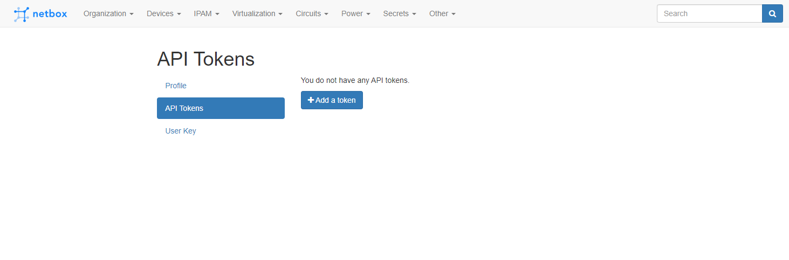
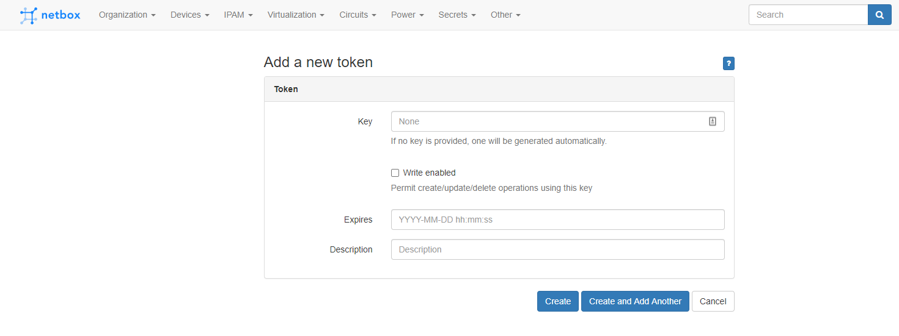
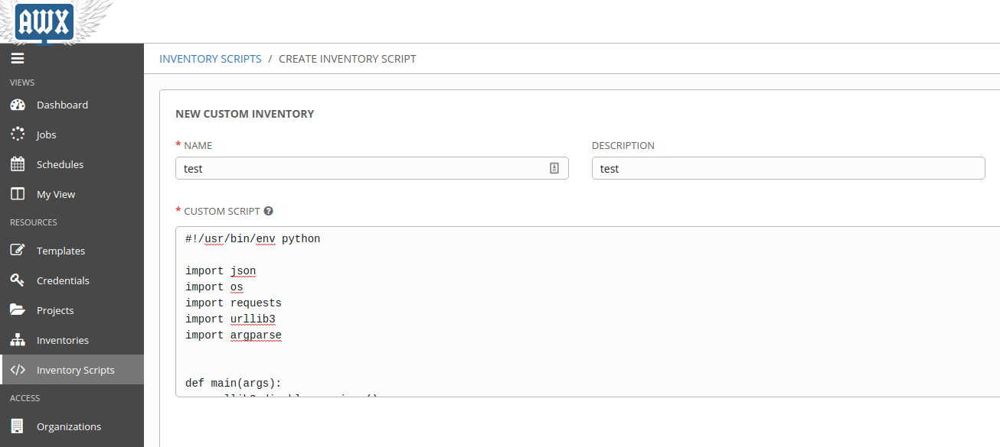
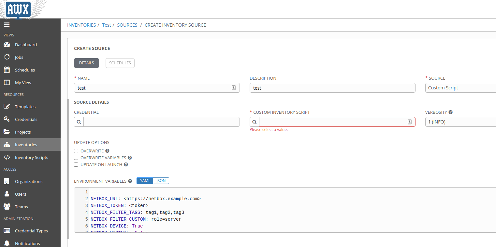

# netbox_inventory

An ansible-inventory compatible script that uses the Rest API for netbox
directly without pynetbox.  The script can be used with Ansible or AWX and 
accepts environment variables or command line variables.

Compatibility checked against:  
* Netbox v2.9.3  
* AWX 14.1.0  
* Ansible 2.9.11  

The script will output a list of devices or virtual machines based on the tags
and/or custom filters provided.
```
usage: netbox_device_inventory.py [options]

Netbox inventory script.

optional arguments:
  -h, --help  show this help message and exit
  --list      list inventory
  -t TOKEN    Authentication Token
  -u URL      URL
  -d          Device list
  -v          Virtual-machine list
  -g TAGS     List of tags ex: switch,managed
  -c CUSTOM   List of custom filters ex: role=switch,model=blah
```

Environment variables supported (used to pass variables to AWX):

`NETBOX_URL`: URL for the Netbox site to be queried  
`NETBOX_TOKEN`: Access Token to be used to access the Netbox site  
`NETBOX_FILTER_TAGS`: List of tags(csv) to be used to return matching objects  
`NETBOX_FILTER_CUSTOM`: Custom list of Netbox attributes to filter  
`NETBOX_DEVICE`: Match on device objects (Default:`True`)  
`NETBOX_VIRTUAL`: Virtual-Machine (Default:`False`)  

## Setup

Install the required libraries
```
pip install -r requirements.txt
```

### Using venv:
Create a virtual environment using python 3.x venv option.
```
python -m venv ~/.venv/inventory
```
Activate the new virtual environment.
```
. ~/.venv/inventory/bin/activate .
```
Update pip
```
pip install pip --upgrade
```
Install the required libraries.
```
pip install -r requirements.txt
```
### Creating an Access Token for Netbox

Navigate to your user profile by clicking on your name at the top right. Select
API Tokens.


Click on Add a token and fill out the required fields.


### Usage

##### Ansible Examples
https://docs.ansible.com/ansible/latest/user_guide/intro_dynamic_inventory.html  

Export your environment variables for silent operation.
```
export NETBOX_URL='https://netbox.example.com'  
export NETBOX_TOKEN='<token>'
export NETBOX_FILTER_TAGS='tag1'
export NETBOX_FILTER_CUSTOM="role=server"
export NETBOX_VIRTUAL=True
```

Use ansible-inventory to output to a host file in yaml format
```
ansible-inventory -i '<../path/>netbox_inventory.py' --list --output inventories/netbox/hosts --yaml
```

Call the inventory script at runtime when launching a playbook
```
ansible-playbook -i '<../path/>netbox_inventory.py' -u root -k -v playbook.yml
```

##### AWX

Add the inventory script contents to a new inventory script.


Create a new inventory and associate the script with the inventory under sources


Associate a schedule with the inventory to update as necessary.
